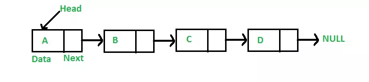
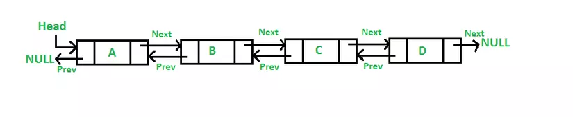
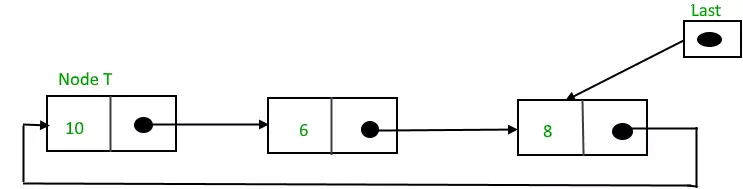

# Linked List
- Là 1 cấu trúc dữ liệu được sử dụng để lưu trữ các tập hợp dữ liệu
- Một Linked List bao gồm các thành phần sau:
## Header
- Là Node đầu tiên của Linked List
## Node
- `Node` sẽ bao gồm : Data,Next
  + Data : Là dữ liệu của Node đó
  + Next : Là con trỏ tham chiếu đến Node tiếp theo
## Tail
- Là Node cuối cùng trong linked list
- Node cuối cùng trỏ đến null
## Size
- Số lượng Node bên trong list
## Các loại Linked List
### Singly Linked List

- Mỗi Node gồm `Data`, `Next` pointer
- `Next` pointer sẽ trỏ tới `Node` tiếp theo trong `Listked List`
- `Next` pointer trỏ tới null là `Node` cuối cùng
### Doubly Linked List

- Mỗi Node sẽ bao gồm : Previous pointer, Next pointer
- Previous pointer trỏ tới Node đứng trước
- Next pointer trỏ tới node phía sau
- Nếu Previous pointer trỏ tới null thì đó là Node đầu tiên
- Next pointer trỏ tới null thì đó là Node cuối cùng
### Circular Linked list

- Giống như `Singly Linked list` nhưng Next pointer của node cuối cùng trỏ tới Node đầu tiên
## Đặc điểm giữa Array và Linked List
### Kích thước
- Array : Kích thước cố định khi khai báo và không thể thay đổi trong quá trình chạy
- Linked List : Kích thước thay đổi được nếu tăng, giảm số lượng phần tử trong quá trình chạy
### Độ phức tạp
- Array : Truy cập phần tử và gán giá trị vào mảng là 0(1) với chỉ số cụ thế
- Linked List : Thêm/Xoa phần tử đầu danh sách là O(1), vị trí bất kì là O(n),n là số phần tử
### Dung lượng
- Array : Có thể gây lãng phí dung lượng nếu kích thước không đổi và không sử dụng hết các vị trí
- Linked List : Sử dụng dung lượng linh hoạt do chỉ cần dung lượng cho các nút thực sự có giá trị

