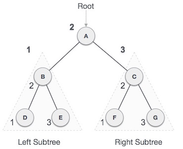

# Tree
- Là 1 cấu trúc dữ liệu được tổ chức dưới dạng các Nodes liên kết với nhau theo 1 cách đặc biệt
- Mỗi nút trong tree có 1 node cha và có thể có nhiều node con
- Node gốc là node không có node cha
- Các node cuối cùng mà không có node con gọi là node lá
- Thường để sử dụng trong mô hình phân cấp, như cây thưc mục
## Node
- Là các điểm dữ liệu trong tree, mỗi node chứa một phần dữ liệu và có liên kết với các node khác
## Root Node
- Là node đỉnh của tree, không có node cha. Tất cả các node khác đều là con, cháu của Root node
## Child Node
- Là node có 1 node cha liên kết đến nó
## Parent Node
- Là Node có liên kết đến một hoặc nhiều node con
## Leaf Node
- Là nút là, những Node mà không có node con
## Siblings
- Các Node cùng chia sẻ của một node cha
## Depth
- Số khoảng cách từ rood Node đến 1 Node cụ thể
- Root Node là level 0
## Height
- Là khoảng cách từ Node đấy đến node thấp nhất trong cái subtree
## Subtree
- Một phần cây có thể xem như 1 cây riêng biệt
## Size
- Là số node trong một tree hoặc một subtree
## Binary Tree
- Là 1 loại cây đặc biệt, Mỗi node trong cây có tối đa hai nút con: Node con trái và Node con phải
## Binary Search Tree
- Là một loại của Binary Tree mà ở đó, Cho mỗi node thì tất cả các node con trong cây con trai có giá trị hơn node đó và tất cả các node trong cây con phải có giá trị lớn hơn node đó
- Độ phức tạp của thuật toán : Log(n)
- Thao tác trên BST : Tìm kiếm, chèn node
### Duyệt Binary Tree

- Duyệt tiền thứ tự (Pre-order Traversal) : D L R
  + Rood Node -> Cây con trái -> Cây con phải
  + A → B → D → E → C → F → G
- Duyệt trung thứ tự (In-order Traversal) : L D R
  + Cây con trái -> Root Node -> Cây con phải
  + Kết quả sẽ được sắp xếp tăng dần
  + D → B → E → A → F → C → G
- Duyệt hậu thứ tự (Post-order Traversal) : L R D
  + Cây con trái -> Cây con phải -> Root node
  + D → E → B → F → G → C → A
## Balanced Tree
- Là cây mà độ cao của các nhánh con không chênh lệch quá nhiều, giúp đảm bỏa hiệu suất tốt cho thao tác trên cây
## Multiway Tree
- Là cây mà mỗi nút có thể có nhiều hơn 2 node con
## Leaf
## 

