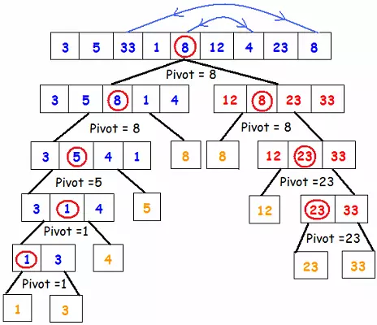

# Devide Conquer
- Giải thuật chia để trị chia bài toán lớn thành các bài toán con nhỏ hơn
- Tiếp tục chia các bài toán con này đến khi không thể chia thêm nữa, ta sẽ giải quyết các bài toán nhỏ này
- Kết hợp giải pháp của tất cả bài toán nhỏ để tìm ra giải pháp ban đầu
## Bài toán 
### Tìm 1 số cho trước x trong mảng đã sắp xếp
- So sánh x với phần từ ở giữa mảng, nếu x nhỏ hơn thì nằm bên trái, ngược lại nằm bên phải
- So sánh x với phần tử nằm giữa của bên trái hoặc bên phải tương ứng
- Cứ so sánh như thế đến khi tìm ra
- Cách này sẽ nhanh hơn so với lặp qua từng phần tử trong mảng và so sánh
```js
  int binarySearch(int array[], int left, int right, int x)
    { 
        // nếu chỉ số left > right dừng lại và return -1 không có kết quả
        if (left > right) return -1;
        // tìm chỉ số ở giữa của mảng
        int mid = (left + right) / 2;
        
        // nếu số cần tìm bằng số ở giữa của mảng thì return
        if (x == array[mid]) 
            return mid;
        
        // nếu số cần tìm nhỏ hơn số ở giữa của mảng thì tìm sang nửa bên trái
        if (x < array[mid]) 
            return binarySearch(array, left , mid-1, x);
  
        // nếu số cần tìm lớn hơn số ở giữa của mảng thì tìm sang nửa bên phải
        if (x > a[mid]) 
            return binarySearch(a, mid+1 , right, x);
    }

```
### Sắp xếp mảng : Quick Sort
- Chia mảng ban đầu thành 2 mảng con với phần tử ở giữa là pivot
- Mảng bên trái là các phần tử nhỏ hơn Pivot, mảng bên phải là các phần tử lớn hơn pivot
- Tiếp tục chia mảng trái và phải thành 2 mảng với 2 pivot tương ứng, trái sẽ nhỏ hơn pivot, phải sẽ lớn hơn pivot
- Sau mỗi lần chia thì sẽ loại pivot ra để chia tiếp, lúc khi chia thì bên trái pivot sẽ là số lớn nhất, bên phải pivot sẽ là số nhỏ nhất
- Cứ chia như vậy cho đến khi mảng đã được sắp xếp

```js
```