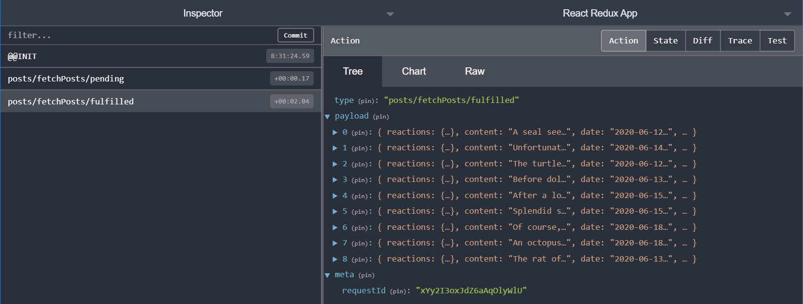

## Middleware
- `Redux` store không biết các async logic. Nó chỉ biết cách gửi `action` 1 cách đồng bộ, cập nhật trạng thái bằng cách gọi hàm `reducer` và thông báo UI rằng có gì đã thay đổi. Các logic không đồng bộ phải xảy ra bên ngoài của hàng
- `Middleware` sử dùng để xử lý các logic không đồng bộ tương tác với `store`, chứng mở rộng `store` và cho phép bạn:
  - Thực thi các logic bổ sung khi bất kì `action` nào được `dispatched`
  - Tạm dừng, sửa đổi, trì hoãn,thay thế hoặc tạm dừng hẳn các `action` đã được `dispatched`
  - Viết thêm code có quyền truy nhập vào `dispatch` , `getState`
  - Dạy cho `dispatch` cách chấp nhận giá trị khác bên cạnh action object như : function, promise bằng cách chặn chúng và thay vào đối gửi đi các action object thực


- Các redux middleware phổ biến nhất : `Redux-thunk`, `Redux-saga`, `Redux-observable`
## Thunk function
- `Thunk` function sẽ luôn gọi với 2 đối số là : `dispatch`, `getState`
- `Thunks` thường sẽ gửi các action đơn giản đến store tương tự như : `dispatch(increment())`

```js
const store = configureStore({ reducer: counterReducer });
const exampleThunkFunction = (dispatch, getState) => {
  const stateBefore = getState();
  dispatch(increment());
  const stateAfter = getState();
};
store.dispatch(exampleThunkFunction);
```

```js
const logAndAdd = (amount) => {
  return (dispatch, getState) => {
    const stateBefore = getState();
    dispatch(incrementByAmount(amount));
    const stateAfter = getState();
  };
};
store.dispatch(logAndAdd(5));
```
- Trong 2 vidu trên, các thunk function là `exampleThunkFunction`,`logAndAdd` cũng  tương tự như là `middleware`, khi có action được dispatch, sẽ chạy vào trong này để xử lý bất đồng bộ như `callapi` và dispatch `action` mới vào `reducer`
## Defining Async Logic in Slices

- `Thunks` có thể xử lý các logic bất đồng bộ bên trong như : `setTimout`, `Promise`, `Async,await`. Điều này làm cho chúng thành một nơi tốt để call API to server
- `Redux toolkit `cung cấp API `createAsyncThunk` để thực thi việc tạo và `dispatch` các action này
```js
// First, define the reducer and action creators via `createSlice`
const usersSlice = createSlice({
  name: 'users',
  initialState: {
    loading: 'idle',
    users: [],
  },
  reducers: {
    usersLoading(state, action) {
      if (state.loading === 'idle') {
        state.loading = 'pending'
      }
    },
    usersReceived(state, action) {
      if (state.loading === 'pending') {
        state.loading = 'idle'
        state.users = action.payload
      }
    },
  },
})
export const { usersLoading, usersReceived } = usersSlice.actions
// Define a thunk that dispatches those action creators
const fetchUsers = () => async (dispatch) => {
  dispatch(usersLoading())
  try {
    const repoDetails = await getRepoDetails(org, repo)
    dispatch(usersReceived(repoDetails))
  } catch (err) {
    dispatch(getRepoDetailsFailed(err.toString()))
  }
}
```
- Cách viết như thế không được clean, mọi request riêng biệt cần được thực hiện tương tự lặp đi lặp lại

## Fetching Data với createAsyncThunk

- API `createAsyncThunk` của Redux toolkit tạo ra các thunks tự động gửi các hành động "start/success/failure" đó cho bạn.
- `createAsyncThunk` có hai đối số :
  - Một chuỗi được dùng làm tiền tố việc tự đồng tạo ra `action types`
  - `payload creator` là callback function sẽ phải return `Promise` chứa dữ liệu hoặc error nếu `Promise` bị `reject`

```js
import { createSlice, nanoid, createAsyncThunk } from "@reduxjs/toolkit";
import { client } from "../../api/client";

const initialState = {
  posts: [],
  status: "idle",
  error: null,
};

export const fetchPosts = createAsyncThunk("posts/fetchPosts", async () => {
  const response = await client.get("/fakeApi/posts");
  return response.data;
});
```
- Khi `dispatch(fetchPosts())`, `fetchPosts` `thunk` sẽ dispatch lần đầu với action type là `posts/fetchPosts/pending`



## Dispatching Thunks từ components

- Tại component, để cập nhật dữ liệu của chúng ta để thực sự tự động tìm nạp dữ liệu này
- Chúng ta sẽ import `fetchPost` thunk vào trong component

```js
const postStatus = useSelector((state) => state.posts.status);
useEffect(() => {
  if (postStatus === "idle") {
    dispatch(fetchPosts());
  }
}, [postStatus, dispatch]);
```

## Reducer và Loading trong các Actions

- `extraReducers` là 1 hàm nhận tham số gọi là `builder`
- `builder` object cung cấp các method cho phép xác định các trường hợp reducers bổ sung
- Chúng tôi dùng `builder.addCase(actionsCreator,reducer)` để xử lý mỗi `actions` được `dispatch` bởi các `thunks async`

- `builder` object trong `extraReducers` cung cấp các methodss cho phép định nghĩa các trường hợp `reducers` sẽ chạy để phản hồi lại các `action` được xác định bên trong `slice`:
  - `builder.addCase(actionCreator, reducer)`: Xác định 1 `reducer` xử lý các `RTK action creator` hoặc `action` là `type:string`
  - `builder.addMatcher(matcher, reducer)` : Xác định 1 `reducer` có thể chạy để phản hồi bất kì action với điều kiện là `matcher` function return true
  - `builder.addDefaultCase(reducer)` : Xác định 1 `reducer` chạy sẽ chạy nếu không có `reducer` nào được thực thi cho `action` này

```js title=features/posts/postsSlice.js
const postsSlice = createSlice({
  name: "posts",
  initialState,
  reducers: {
    // omit existing reducers here
  },
  extraReducers(builder) {
    builder
      .addCase(fetchPosts.pending, (state, action) => {
        state.status = "loading";
      })
      .addCase(fetchPosts.fulfilled, (state, action) => {
        state.status = "succeeded";
        // Add any fetched posts to the array
        state.posts = state.posts.concat(action.payload);
      })
      .addCase(fetchPosts.rejected, (state, action) => {
        state.status = "failed";
        state.error = action.error.message;
      });
  },
});
```

- Xử lý 3 action types có thể được dispatched bởi thunk vừa trên promise trả về.

## Hiển thị Loading State
- Lấy trạng thái loading trong store để hiện thi loading trên UI
```js
const postStatus = useSelector(state => state.posts.status)
const error = useSelector(state => state.posts.error)
```
## Loading Users
```js title=userSlice.js
export const fetchUsers = createAsyncThunk('users/fetchUsers', async () => {
  const response = await client.get('/fakeApi/users')
  return response.data
})
const usersSlice = createSlice({
  name: 'users',
  initialState,
  reducers: {},
  extraReducers(builder) {
    builder.addCase(fetchUsers.fulfilled, (state, action) => {
      return action.payload
    })
  }
})
```
```js title=index.js
 store.dispatch(fetchUsers())
```
## Adding New Posts
### Gửi data với thunks
```js
export const addNewPost = createAsyncThunk(
  'posts/addNewPost',
  async initialPost => {
    const response = await client.post('/fakeApi/posts', initialPost)
    return response.data
  }
)
const postsSlice = createSlice({
  name: 'posts',
  initialState,
  reducers: {
    // The existing `postAdded` reducer and prepare callback were deleted
    reactionAdded(state, action) {}, // omit logic
    postUpdated(state, action) {} // omit logic
  },
  extraReducers(builder) {
    builder.addCase(addNewPost.fulfilled, (state, action) => {
      state.posts.push(action.payload)
    })
  }
})
```
