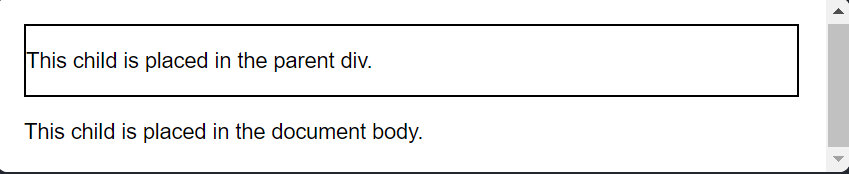

# createPortal

- `createPortal` cho phép bạn render thành phần con bên trong một thành phần khác của DOM

```js
<div>
  <SomeComponent />
  {createPortal(children, domNode, key?)}
</div>
```

## Các thành phần

### createPortal(children, domNode, key?)

- Để tạo 1 `portal`, gọi `createPortal` và truyền vào JSX, và DOM node nới JSX sẽ được render vào

```js
<p>This child is placed in the parent div.</p>;
{
  createPortal(
    <p>This child is placed in the document body.</p>,
    document.body,
  );
}
```

## Cách sử dụng

### Render vào thành phần khác của DOM

````js
<div style={{ border: '2px solid black' }}>
      <p>This child is placed in the parent div.</p>
      {createPortal(
        <p>This child is placed in the document body.</p>,
        document.body
      )}
    </div>
    ```
````



- Thường sử dụng để tạo Modal hiển thị chèn lên thành phần cha
