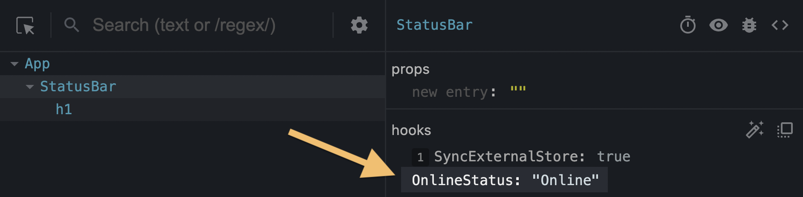

# useDebugValue
- `useDebugValue` là 1 hook cho phép bạn thêm label cho 1 custom hook trong react dev tool để dễ dàng debug
- `useDebugValue` không return ra bất cứ giá trị gì
```js
useDebugValue(value, format?)
```
## Tham số
- `value` : Là giá trị bạn muốn hiển thị trong react dev took. Nó có thể là bất kì kiểu dữ liệu nào
- `format` : Là 1 function đươc gọi trong react dev tools khi component được kiểm tra. Nó nhận `value` là đối số và hiển thị kết quả trả về. Nếu không có `format`, mặc định `value` sẽ được hiển thị
## Cách sử dụng
### Thêm label cho 1 custom hook
```js
import { useDebugValue } from 'react';

function useOnlineStatus() {
  useDebugValue(isOnline ? 'Online' : 'Offline');
}
```
- Điều này sẽ cung cấp component gọi custom hook `useOnlineStatus` như một label là `OnlineStatus:Online` khi bạn inspect : 

- Nếu không gọi `useDebugValue`, chỉ dữ liệu cơ bản mới được hiển thị
### Trì hoãn định dạng của 1 debug value
- Bạn cũng có thể chuyển một hàm định dạng làm đối số thứ hai cho `useDebugValue`:
```js
useDebugValue(date, date => date.toDateString());
```
- Formating function sẽ nhận `debug value` như một tham số và chỉ nên trả về `formatted value`
- Khi inspect component, React dev tools sẽ gọi function này và hiển thị kết quả

## Chú ý
- `useDebugValue` chỉ sử dụng khi custom hook
- `useDebugValue` giúp cho việc hiển thị value của data trong custom hook ở React dev tools để nhìn hơn
- [Test useDebugValue](http://localhost:3000/hooks/useDebugValue)