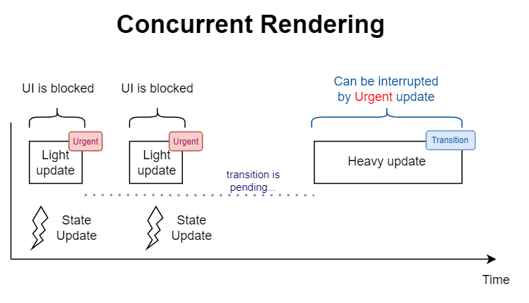

# useTransition
- Mặc định, tất cả các cập nhật giao diện trong React đều có mức độ khẩn cấp, cần thực hiện ngay lập tức. 
- Điều đó có thể gây ra sự cố khi các bản cập nhật nhanh bị chậm(block) lại bởi các bản cập nhật nặng.


- `useTransition` là 1 hook cho phép bạn cập nhật `state` mà không chặn UI
```js
const [isPending, startTransition] = useTransition()
```
## Tham số
### isPending
- `isPending` là giá trị để xác định quá trình chuyển đổi có đang chờ hay không
### startTransition
- `startTransition` là 1 function dùng để đánh dấu `state` như 1 `transition`
- `startTransition` không return gì cả
- function mà bạn truyền vào `startTransition` phải là **đồng bộ**
- `Scope` của `startTransition` là 1 function mà trong đó sẽ cập nhật các state
- React sẽ gọi `scope` này ngay lập tức mà không có tham số 
- Đánh dấu tất cả các `state` được lên lịch đồng bộ trong khi gọi `scope` như một `transtion`
- Chúng sẽ không bị chặn và sẽ không hiển thị các loading
```js
 function selectTab(nextTab) {
    startTransition(() => {
      setTab(nextTab);
    });
  }
```
## Cách sử dụng
### Đánh dấu 1 state cần update là thuộc quá trình chuyển và đổi không bị chặn
- `Transition` cho phép bạn giữ các bản update ui được phản hồi nhanh
- UI của bạn vẫn được phản hồi ngay giữa quá trình re-render
Vd : Người nhấp vào 1 tab nhưng sau lại nhấp vào tab khác, họ có thể làm điều đó mà không cần đợi quá trình re-render lại lần đầu tiên kết thúc
```js
      <TabButton
        isActive={tab === 'about'}
        onClick={() => selectTab('about')}
      >
        About
      </TabButton>
```
### Cập nhật component cha trong transition
- Bạn có thể cập nhật state ở component cha từ lệnh gọi `useTranstion`
- Vd: `TabButton` bọc `onClick` trong transiton
```js
export default function TabButton({ children, isActive, onClick }) {
  const [isPending, startTransition] = useTransition();
  if (isActive) {
    return <b>{children}</b>
  }
  return (
    <button onClick={() => {
      startTransition(() => {
        onClick();
      });
    }}>
      {children}
    </button>
  );
}
```
- Component cha cập nhật trạng thái của nó bên trong event `Onclick`, cập nhật `state` này được đánh dấu là quá trình đang chuyển đổi
- Vì vậy việc update `tab` đã được đánh dấu là một quá trình chuyển đổi, do đó nó không chặn tương tác người dùng
### Hiển thị trạng thái đang chờ trong quá trình transtion
- Sử dụng giá trị isPending để xác định rằng quá trình chuyển đổi đang diễn ra
```js
if (isPending) {
    return <b className="pending">{children}</b>;
  }
  return (
    <button onClick={() => {
      startTransition(() => {
        onClick();
      });
    }}>
      {children}
    </button>
  );
```
### Ngăn chặn các loading không mong muốn
- Component `PostTab` tìm nạp dữ liệu. Khi click vào `Posts` tab, component `PostTab` sẽ tạm dừng và `fallback` trong suspends sẽ xuất hiện
```js
  <Suspense fallback={<h1>🌀 Loading...</h1>}>
      <TabButton
        isActive={tab === 'about'}
        onClick={() => setTab('about')}
      >
        About
      </TabButton>
  </Suspense>
```
- Khi 1 `TabButton` tìm nạp dữ liệu sẽ hiển thị Loading cho toàn bộ UI những `TabButton` gẫy kém UI/UX
- Vì thế nên sử dụng `useTranstion` cho `TabButton` 
```js title="TabButton.jsx"
if (isPending) {
    return <b className="pending">{children}</b>;
  }
  return (
    <button onClick={() => {
      startTransition(() => {
        onClick();
      });
    }}>
  )
```
### Xây dựng bộ định tuyến hỗ trợ Suspense
- Nếu bạn xây dựng React app với router, bạn nên sử dụng navigations các pages như là `transtions`
```js
const [isPending, startTransition] = useTransition();

  function navigate(url) {
    startTransition(() => {
      setPage(url);
    });
  }
```
- `Transtions` có thể bị gián đoạn, cho phép user click chuột đi mà không cần đợi kết xuất lại hoàn tất
- `Transtions` ngăn chặn loading, cho phép người dùng tránh các loading khi điều hướng
- Theo mặc định, các router hỗ trợ`suspense` sẽ bọc các navigation updates thành các `transtion`
## Các sự cố thường gặp
### Cập nhật 1 input bằng `transtion` không hoạt động
- Bạn không thể dùng `transtion` cho `state` dùng cho input: 
```js
function handleChange(e) {
  // ❌ Can't use transitions for controlled input state
  startTransition(() => {
    setText(e.target.value);
  });
}
```
- `Transtions` là non-blocking, việc update input để đáp dứng sự kiện thay đổi sẽ diễn ra đồng bộ
- Nên sử dụng `useDeffredValue` sẽ làm trì hoãn giá trị thật. Nó sẽ kích hoạt non-blocking đến khi bắt kịp giá trị mới 1 cách tự động
### React không coi update state là transtion
- Function mà bạn truyền vào `startTranstion` phải là đồng bộ
```js
startTransition(() => {
  // ❌ Setting state *after* startTransition call
  setTimeout(() => {
    setPage('/about');
  }, 1000);
});
```
- Bạn nên sửa lại như sau
```js
setTimeout(() => {
  startTransition(() => {
    // ✅ Setting state *during* startTransition call
    setPage('/about');
    
  });
}, 1000);
```
### Tôi muốn gọi useTranstion bên ngoài component
- Bạn không thể gọi `useTranstion` bên ngoài 1 component bởi vì nó là 1 hook
- Trường hợp này, sử dụng `startTranstion` độc lập, nó hoạt động theo cách tương tự nhưng ko cung cấp `isPending`
## Tổng quát
- `useTransition` cho phép cập nhật `state` mà không chặn UI
- `state` cũ của UI chưa render xong , lúc này khi ta update `state` sẽ không chặn UI đó mà sẽ thực thi UI với `state` mới
- `useTranstion` return `[isPending,startTranstion]`
- `isPending` để xác định trạng thái quá trình chuyển đổi hoàn thành hay đang chờ
- `startTranstion` Cho phép bạn đánh dấu bất kì bản cập nhật `state` nào đó ở `state` ưu tiên thấp (transition)
Vd: Chuyển đổi giữa các tab qua `state tab` 
```js
  const [isPending, startTransition] = useTransition();
  const [tab, setTab] = useState('about');
  function selectTab(nextTab) {
    startTransition(() => {
      setTab(nextTab);      
    });
  }
  {tab === 'about' && <AboutTab />}
  {tab === 'posts' && <PostsTab />}
  {tab === 'contact' && <ContactTab />}
```
- `state tab` = posts thì UI (`PostsTab`)
- Khi UI này chưa render xong, load xong dữ liêu
- update `state tab` = 'contact'
- Quá trình chuyển đổi sẽ bỏ qua `state posts` dù nó chưa render UI xong để chuyển qua render UI `ContactTab`
- `UI PostsTab` sẽ không chặn `ContactTab` khi `state` thay đổi dù `UI PostsTab` chưa hoàn thành
- [Test useTransition](https://codesandbox.io/s/usetranstion-hy97p9)


