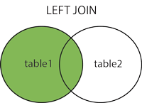

# SQL
## Select record
### Where
Operator	Description
- `<`	: Nhỏ hơn
- `<=`: Nhỏ hơn hoặc bằng
- `>`	: Lớn hơn
- `>=` : Lớn hơn hoặc bằng
- `=	, is` : Bằng
- `<> , !=` : Không bằng
- `BETWEENT` : `where age BETWEEN 20 AND 40`
- `LIKE` : Dùng để truy vấn với pattern
- `IN` : `WHERE City IN ('Paris','London')`
```sql
SELECT age, country
FROM Customers
WHERE age <= 28;
```
### LIKE, Wildcards
- `%` : Đại diện cho 0 hoặc nhiều kí tự
`bl%` -> bl, black,blue,blob
- `-` : Đại diện cho 1 kí tự duy nhất
`h_t` -> hot, hat, hit
- `[]` : Đại diện cho bất kì kí tự nào nằm trong ngoặc
`h[oa]t` -> hot, hat
- `^` : Đại diện cho bất kì kí tự nào ko nằm trong ngoặc
`h[^oa]` -> hit,hât
- `-` : Đại diện cho bất kì kí tự nào bên trong khoảng
`c[a-b]` -> cat, cbt
### AND, OR, NOT
- AND
```sql
WHERE age > 23 OR country = 'USA'
```
- NOT
```sql
WHERE country <> 'UK';
WHERE country != 'UK';
WHERE NOT country = 'UK';
```
### Distinct
- Chọn ra column với dữ liệu không trùng lắp
```sql
SELECT DISTINCT column1, column2, ...
FROM table_name;
```
### ORDER BY
- Sắp xếp tăng dần hoặc giảm dần
```sql
ORDER BY column1, column2, ... ASC|DESC;
```
### NULL , IS NOT NULL
- Kiểm tra record là null hoặc not null trong table
```sql
select first_name
from Customers
where country is not null
```
### LIMIT
- Xác định số lượng record cần lấy trong table
```sql
SELECT * FROM Customers
LIMIT 3;
```
### MIN , MAX
- Lấy ra record có giá trị lớn nhất và nhỏ nhất trong table
```sql
SELECT MIN(age) AS MinAge
FROM Customers;
```
### Count, Avg, Sum
- COUNT : Trả về số record thỏa mãn điều kiện nào đó
```sql
SELECT COUNT(country)
FROM Customers
WHERE age IS NOT NULL
```
- AVG : Trả về giá trị trung bình của column
- SUM : Trả về giá trị tổng của column
### ALIASES
- Hiển thi column với tên khác
```sql
SELECT CustomerID AS ID, CustomerName AS Customer
FROM Customers
```
## INSERT
- Thêm record vào database
```sql
INSERT INTO Customers (CustomerName, ContactName, Address, City, PostalCode, Country)
VALUES ('Cardinal', 'Tom B. Erichsen', 'Skagen 21', 'Stavanger', '4006', 'Norway');
```
## UPDATE
- Cập nhật record trong table
```sql
UPDATE Customers
SET country = 'VIETNAM',first_name = 'Thuy'
WHERE customer_id = 8
```
## DELETE
- Xóa record trong table
```sql
DELETE FROM Customers WHERE CustomerName='Alfreds Futterkiste';
```
## JOINS
### INNER JOIN
- Dùng chọn các record có giá trị phù hợp cho cả hai table

```sql
SELECT Customers.first_name FROM Customers
INNER JOIN Orders
ON Customers.customer_id = Orders.customer_id
```
### LEFT JOIN
- Dùng để chọn tất cả các record từ bảng trái kết hợp các  record phù hợp ở bảng phải
### RIGHT JOIN
- Dùng để chọn tất cả các record từ bảng phải kết hợp các  record phù hợp ở bảng trái
### FULL OUTER JOIN
- Dùng để chọn tất cả các record từ cả hai bảng
## UNION
- Là toán tử dùng để kết hợp kết quả của hai hoặc nhiều câu lệnh select
```sql
SELECT country
FROM Customers
WHERE country like 'U_E'
UNION
SELECT status
FROM Shippings
```
## GROUP BY
- Nhóm các hàng có cùng giá trị thành các hàng tóm tắt
- Thường được dùng với: COUNT,MAX,MIN,AVG,SUM
```sql
SELECT SUM(age), country
FROM Customers
GROUP BY country
```
## HAVING
- Là mệnh đề điều kiện được thêm vào với `GROUP BY` vì không sử dụng được WHERE
```sql
SELECT SUM(age) as SumAge, country
FROM Customers
GROUP BY country
HAVING SumAge < 30
```
## EXISTS
- Kiểm tra sự tồn tại của bất kì bản ghi nào trong truy vấn con
- Trả về true nếu truy vấn con trả về 1 hoặc nhiều bản ghi
```sql
SELECT item
FROM Orders
WHERE EXISTS (SELECT first_name FROM Customers WHERE Customers.customer_id = Orders.customer_id AND amount < 300);
```